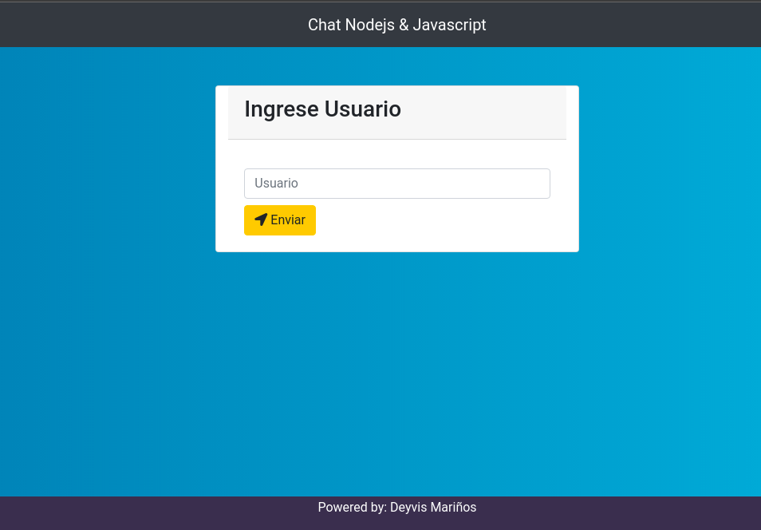
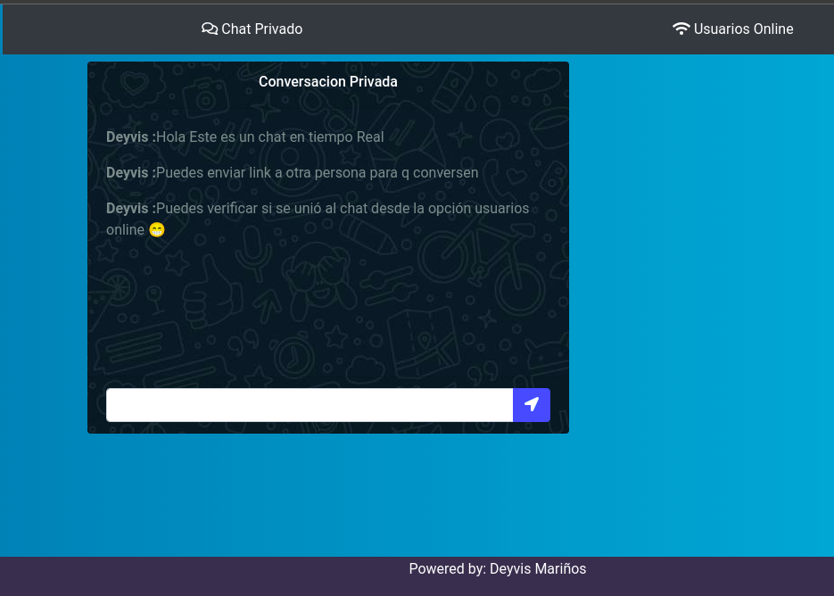

# Group Chat Real Time

A small group chat with websocket's


## Screenshots



## Environment Variables

To run this project, you will need to add the following environment variables to your .env file

`MONGODB_URI_CONNECT`  : 
Connecting to your MongoDB database


## Tech Stack

**Client:** Html, Css, Javascript Vanilla

**Server:** Node, Express, Mongoose, Socket.io


## Demo

link to demo

https://chat-privado-nodejs.herokuapp.com/
## Run Locally

Clone the project

```bash
  git clone https://github.com/Deyvis17GY/reto-deezer.git
```

Go to the project directory

```bash
  cd chat-privado-nodejs
```

Install dependencies

```bash
  yarn install
```

Start the server

```bash
  yarn start
```

